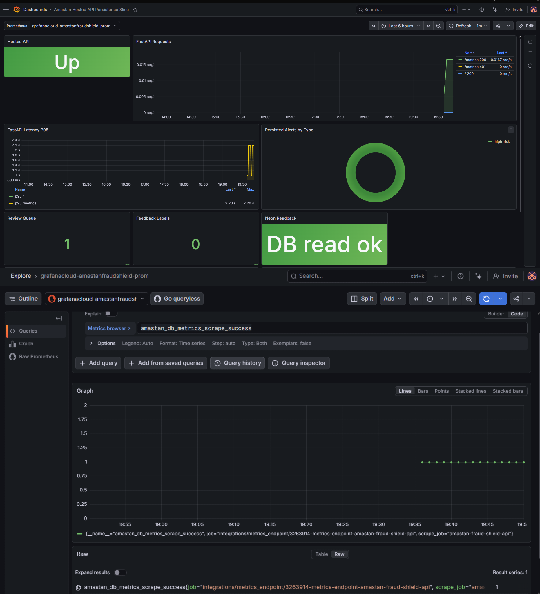
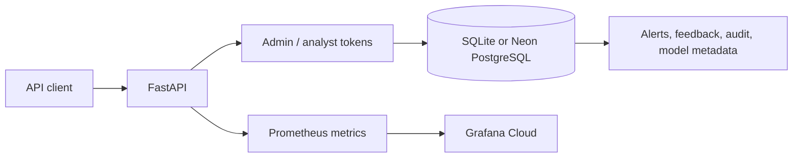

# Amastan Fraud Shield Guard

A small fraud alert review API for Tunisian digital payments.

The hosted demo runs FastAPI on Hugging Face Spaces and stores data in Neon
PostgreSQL. The same code uses SQLite locally.

The project is finished and in maintenance mode.

[Release](https://github.com/ReguiguiMohamed/hybrid-real-time-fraud-detection-tunisia/releases/tag/v0.1.0)
| [API reference](docs/API_REFERENCE.md)
| [Deployment](docs/DEPLOYMENT.md)
| [OpenAPI](docs/openapi.json)
| [Security](SECURITY.md)

## What It Does

- Stores fraud alerts.
- Gives analysts a review queue.
- Records analyst feedback.
- Exports reviewed cases.
- Tracks model metadata and training outcomes.
- Reports drift and review metrics.
- Exposes Prometheus metrics for Grafana Cloud.
- Keeps an audit trail for important changes.

Bearer tokens separate admin and analyst access.

## Proof

The first image shows the hosted API, an authenticated Swagger request, and the
same alert in Neon PostgreSQL.


The second image shows the Grafana Cloud dashboard and the metric query behind
it.



The dashboard export is stored at
[`docs/grafana-dashboard.json`](docs/grafana-dashboard.json).

## Architecture



This repository contains that deployed slice only. Earlier Kafka, Spark,
Streamlit, Ollama, ChromaDB, Kubernetes, and local monitoring experiments were
removed during final cleanup.

## Main Endpoints

| Method | Path | Purpose |
|---|---|---|
| `GET` | `/health/` | Health and version |
| `POST` | `/api/v1/alerts/add/` | Store an alert |
| `GET` | `/api/v1/alerts/review-queue/` | Read the review queue |
| `POST` | `/api/v1/feedback/` | Record analyst feedback |
| `GET` | `/api/v1/stats/` | Review statistics |
| `GET` | `/api/v1/compliance/kpis/` | Compliance indicators |
| `GET` | `/api/v1/model/training-summary` | Model training history |
| `GET` | `/metrics` | Prometheus metrics |

Swagger is available at `/docs`.

## Run Locally

Python 3.11 or 3.12 is required.

```powershell
python -m pip install -r requirements-dev.txt

$env:ADMIN_TOKEN = "local-admin"
$env:ANALYST_TOKEN = "local-analyst"
$env:DATABASE_URL = "sqlite:///./data/feedback.db"

python -m uvicorn dashboard.api:app --reload --port 8001
```

Open `http://localhost:8001/docs`.

## Test

```powershell
$env:PYTEST_DISABLE_PLUGIN_AUTOLOAD = "1"
python -m pytest tests -q
black --check src dashboard scripts tests
isort --check-only src dashboard scripts tests
flake8 src dashboard scripts tests
bandit -r src dashboard scripts -lll
```

CI also regenerates the OpenAPI file and a deterministic backtest artifact.

## Repository

```text
dashboard/        FastAPI app and analytics
src/compliance/   Filing deadlines and change audit
src/ml/           Model lifecycle persistence
src/shared/       Database, logging, risk config, version
scripts/          OpenAPI and backtest utilities
tests/            API and domain tests
docs/             API, deployment, OpenAPI, Grafana evidence
```

## Scope

Before public or production use:

- rotate every token;
- rehearse schema changes against PostgreSQL;
- define backups and retention;
- replace static bearer tokens with managed identity;
- validate legal and reporting rules with the responsible institution.

## License

[MIT](LICENSE)
